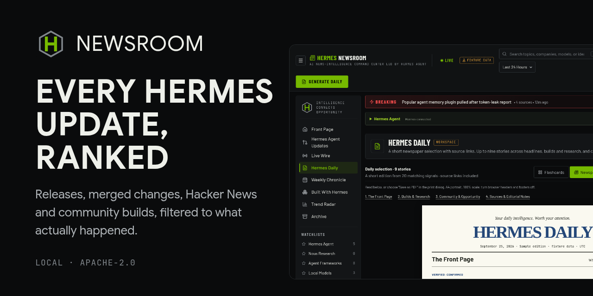
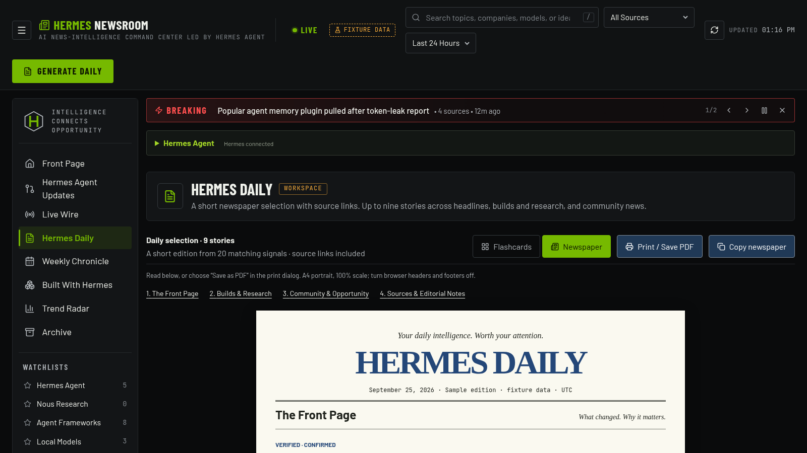
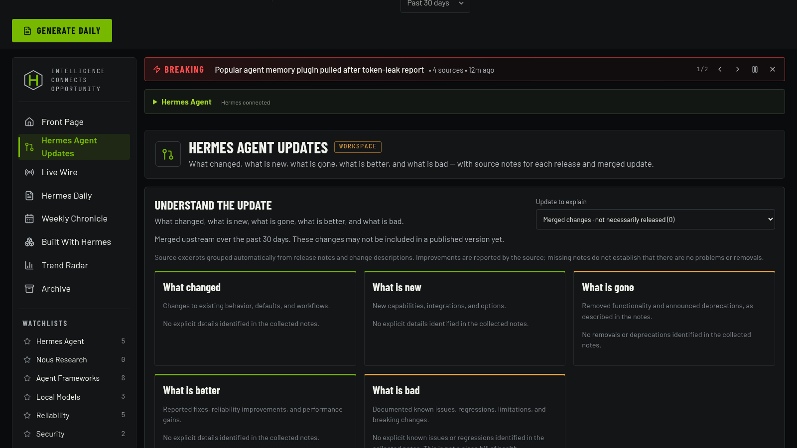
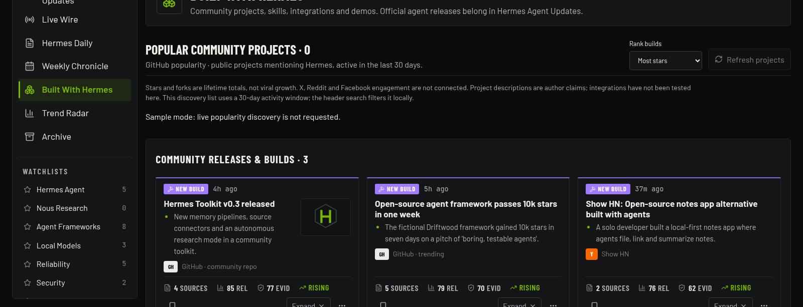

# Hermes Newsroom



A local, privacy-first news-intelligence command center for
[Hermes Agent](https://nousresearch.com). It gathers public signals about Hermes
and its ecosystem, keeps the ones that report an event, and presents them as a
front page, a live wire, daily and weekly editions, and a searchable archive.

It reports. It does not draft posts, queue work, or publish anything.

## What you get



A daily edition you can read or print, built from what the sources actually published.



Every release and merged change, sorted into what changed, what is new, what is gone, what is better and what is bad — quoted from the notes, never written by a model.



What the community is shipping on Hermes, so you can find a project again next week.

Screenshots use the bundled demo data, which is what you see before turning live
sources on.

## The sections

| Section                  | What it shows                                                                     |
| ------------------------ | --------------------------------------------------------------------------------- |
| **Front Page**           | The most important intelligence right now, filled to a full page.                 |
| **Hermes Agent Updates** | What changed, is new, is gone, is better and is bad, from source statements only. |
| **Live Wire**            | Every incoming signal in order, as it lands.                                      |
| **Hermes Daily**         | Today's edition as flashcards, or a four-page newspaper to read and print.        |
| **My Hermes Daily**      | A personal newspaper built from your own Hermes work records.                     |
| **Weekly Chronicle**     | The week around Hermes Agent: releases, merges, and what the community shipped.   |
| **Built With Hermes**    | New projects, skills and tools people are building on Hermes.                     |
| **Trend Radar**          | Topic coverage across connected sources, with momentum where it is measured.      |
| **Archive**              | Saved and dismissed stories, searchable.                                          |

Opening the app goes straight to the Newsroom front page.

## Install

Node.js 22 or newer. Linux, macOS and Windows — checked by CI on all three.

One section, **My Hermes Daily**, also needs Python 3 on `PATH` (and `pip install
tzdata` on Windows). Everything else is Node-only. See
[docs/platform-support.md](docs/platform-support.md).

### Let your Hermes agent do it

Newsroom ships an install skill, so the agent you already talk to can set it up
and know what it is doing. Give it the skill once:

```sh
hermes skills install https://raw.githubusercontent.com/BkashJEE/hermes-newsroom/main/skills/install-hermes-newsroom/SKILL.md
```

Then say:

> Install Hermes Newsroom

Without the skill it still works — point the agent at this repository and ask for
it — but the skill is what makes the agent already know the steps, the rails and
the verification rather than reading them off a page.

It will check your Node version, ask where you keep projects, clone and build,
install the desktop plugin into your Hermes home, and offer to start Newsroom at
login. It shows you the exact list of files first. It never asks for a key,
because there is nothing here to authenticate against.

### Or three commands

```sh
git clone https://github.com/BkashJEE/hermes-newsroom
cd hermes-newsroom
npm ci && npm run build && npm run setup
```

`npm run setup` is the same installer the skill uses. Add `--dry-run` to see
every step before it happens, or `--autostart` to have it running whenever you
sign in:

```sh
node scripts/install.mjs --dry-run
node scripts/install.mjs --autostart      # systemd, launchd or Startup, per platform
```

Then **restart the Hermes Desktop app** — disk plugins are scanned at startup,
not on a window reload — and Newsroom appears in the sidebar. In a browser it is
at `http://127.0.0.1:3520/newsroom`.

### What you get on first run

Newsroom starts with no configuration and no keys, on clearly labelled demo data.
To read the real thing, turn on live sources:

```sh
cp config/newsroom.example.json config/newsroom.local.json
# then set  "liveSources": true  in that file and restart
```

GitHub and Hacker News need nothing else. Bluesky and Reddit are queried
anonymously and can be refused by those services depending on where you run it;
if that happens the feed says so rather than hiding it, and you can switch them
off with `"socialSources": { "bluesky": false, "reddit": false }`. X collection
is separate, off by default, and documented in [SECURITY.md](SECURITY.md).

`config/newsroom.local.json` is git-ignored, so your watchlists stay yours.

The desktop plugin is its own one-file repository:
[hermes-newsroom-plugin](https://github.com/BkashJEE/hermes-newsroom-plugin).
The installer fetches it for you; you never have to visit it.

## Hermes Newsroom

Ranked, evidence-scored AI intelligence, with a clear next action for each story.

- **Front Page**: lead intelligence story, Developing / Community Signal / New Build flashcards, a Live Intelligence list, and a decision rail (What Should I Do?, Signal Meter, Trending Now, Content Opportunity).
- **Command bar**: live/paused, search, source and time filters, manual refresh, last-updated time, Generate Daily.
- **Breaking ticker**: dismissible, pausable, and it never auto-advances under reduced motion.
- **Filters**: search, source, time range, intelligence type, sort and watchlist. All persist in the URL.
- **Intelligence file** drawer: full summary, why it matters, evidence, original source, conflicting evidence, Hermes relevance, recommended next action.
- **Local-only actions**: Post, Reply, Test, Build, Track, Ignore. Drafts, tasks and build ideas go to a Desk queue on this device. **Nothing is published.** Explicit Hermes generation sends the selected story context to your configured local Hermes gateway.

### Hermes and live sources

All eight sections work with the current feed. Each has a **Hermes Agent** panel;
daily/weekly briefs and post/reply drafts can be written by the installed agent.
Content Desk supports saved drafts, edits, copying and removal. Archive retains
saved and dismissed stories across feed changes.

The committed default is clearly labelled fixture data. Set `liveSources: true`
in ignored `config/newsroom.local.json` for Hacker News AI discussions and official
Hermes GitHub releases. Bluesky and Reddit are free and permitted to query. Optional X browser captures are available through a local scheduled collector that is **off by default**: automating X is contrary to its Terms of Service even from your own session, and the risk is to your account, so it is opt-in, personal-scale and public results only (see [SECURITY.md](SECURITY.md)). Facebook is not connected. See [browser collection](docs/browser-x-collector.md). Scores are
heuristics, not independent verification, and historical momentum is not measured.

Deployment installs `hermes-newsroom` controls and a skill in existing Hermes
profiles. `hermes-newsroom status` reports the exact source repo, runtime, URL,
workspace, providers and gateway status. The source path is generated locally,
never committed. See [Hermes control and source limitations](docs/hermes-control.md).

## Run it

Requires Node.js 22 or newer.

```bash
npm install
npm run dev      # http://127.0.0.1:3510
```

No environment variables or private configuration are needed. Optional settings are listed in [`.env.example`](.env.example).

Developed and tested on Linux (Omarchy). The app itself has no POSIX-only
assumptions and is expected to run on Windows, but that is unverified; macOS is
untested because the owner has no Mac. Deployment helpers under `scripts/` are
Linux-only. Details, and what to report if it breaks: [docs/platform-support.md](docs/platform-support.md).

### Persistent desktop deployment

Run `npm run deploy:local` to verify and build the app, rsync a self-contained release
under `$HOME/.local/share/omarchy-command-center-releases`, atomically point
`$HOME/.local/share/omarchy-command-center` at it, and enable/restart the user service.
Requires rsync, Python 3, systemd user services and Node.js on PATH. The service
listens only on `http://127.0.0.1:3520`; it starts at login and restarts on failure.
Development edits do not affect the deployed copy. Releases are retained for rollback.
The deploy script backs up a changed unit and rolls back the release if health checks fail.

```bash
npm run deploy:local
systemctl --user is-enabled omarchy-command-center.service
systemctl --user is-active omarchy-command-center.service
curl --fail http://127.0.0.1:3520/api/newsroom
# Smoke adapts to the displayed live or fixture stories.
BASE_URL=http://127.0.0.1:3520 SMOKE_PRODUCTION=1 npm run test:smoke
```

The Newsroom pages omit the duplicate web tab strip and use the persistent desktop
bar for workspace navigation. Other Command Center pages retain their tabs.

The desktop configuration is maintained separately in the dotfiles repository.
It reserves workspace 8, launches through `omarchy-launch-webapp`, and uses a
dedicated browser profile at `$HOME/.local/share/omarchy-newsroom-browser` with a
loopback-only, dynamically assigned debugging port. `scripts/newsroom-window.mjs`
uses the existing Playwright dependency to navigate that window without opening
tabs or touching the ordinary browser profile. The `generate` action opens the
local Generate Daily dialog; other actions use the existing section routes.
The dialog includes an explicit **Write daily with Hermes** action.

### Personal configuration

Copy `config/newsroom.example.json` to `config/newsroom.local.json` (git-ignored) to use your own watchlists. Secrets go in `.env` (git-ignored) and are read on the server only.

`HERMES_API_URL` and `HERMES_API_KEY` override automatic Hermes discovery independently.
Use a loopback base URL with its port, without `/v1`. Deploy copies `.env` to the
private runtime with mode 0600. See [provider configuration and tool-isolation limits](docs/providers.md).

The separate personal work newspaper is disabled by default. Enable
`personalDaily.enabled` only in local configuration; see [Personal Daily data flow](docs/personal-daily.md).
Its generation sends selected work excerpts through the local Hermes gateway, which may call a cloud model.
The installed gateway currently ignores request-level `tools: []` / `tool_choice: "none"`;
its editorial system prompt does not provide tool isolation.

### Development scenarios

Add `?scenario=` to `/newsroom` to force an interface state: `slow` (loading skeleton), `empty`, `error` (every provider fails), `partial` (one provider fails), `stale`, `offline`. Scenarios are disabled in production builds unless `NEWSROOM_ENABLE_SCENARIOS=1`.

## Checks

```bash
npm run format:check   # Prettier
npm run lint           # ESLint
npm run typecheck      # TypeScript
npm test               # Vitest: model, providers, UI behaviour, open-source hygiene
npm run build          # production build
npm run verify         # all of the above
```

With the app running (`npm run dev` or `npm run build && npm start`):

```bash
npm run test:smoke     # real-browser checks: every tab, filters, dialogs, actions, states, layouts, console
npm run screenshots    # PNGs at 2560×1440, 1920×1080 and smaller sizes → artifacts/ (git-ignored)
```

Both use `playwright-core`. If Playwright's own Chromium is not installed, point `CHROMIUM_PATH` at a Chromium binary.

## Project layout

```
src/app/                 routes (tabs, /newsroom, /newsroom/[section], /api/newsroom)
src/components/shell/    tab strip, purpose menus, desktop-tab overview
src/config/              app name, tab definitions
src/newsroom/model/      story model, filters/sorting, derived widgets (pure)
src/newsroom/providers/  interface, aggregator, fixture and live adapters (server)
src/newsroom/fixtures/   synthetic stories
src/newsroom/hermes/     local summaries and server-side Hermes gateway bridge
src/newsroom/state/      client store (URL filters, local overlays)
src/newsroom/components/ Newsroom UI
config/                  example configuration (local copies are ignored)
docs/                    architecture, providers, open-source checklist
tests/                   Vitest suites
scripts/                 smoke test and screenshot capture
```

## License

[Apache-2.0](LICENSE). Contributions are licensed under the same terms.

## Not affiliated with Nous Research

This is an independent personal project. "Hermes Agent" and "Nous Research" are
used to say what this software reads and reports on, not to suggest endorsement,
affiliation or support. Hermes Agent belongs to
[Nous Research](https://nousresearch.com). The monogram in the interface is
original artwork, not the Hermes logo. Source badges are plain letters rather
than third-party marks.

Security reports: [SECURITY.md](SECURITY.md). Contributing:
[CONTRIBUTING.md](CONTRIBUTING.md). Release readiness:
[docs/open-source-checklist.md](docs/open-source-checklist.md).

### Daily reading views

Hermes Daily opens as a responsive grid of flashcards for all matching, undismissed stories. Use **Newspaper** for a four-page editorial selection with short bullets, source links and a source ledger. **Print / Save PDF** uses that newspaper layout from either view; choose A4 portrait, 100% scale and disable browser headers/footers. The browser handles PDF saving locally. This is a feed-based edition, not an automatic model-generated report.

Built With Hermes also discovers public community projects and integrations on GitHub, ranked by lifetime stars with visible fork counts and last-push dates. Official agent releases are listed separately. Social virality from X/Reddit/Facebook and recent star-growth rates are not yet available; see [provider coverage](docs/providers.md).
